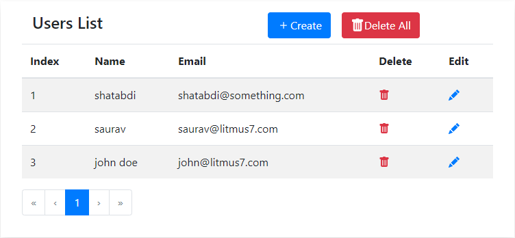
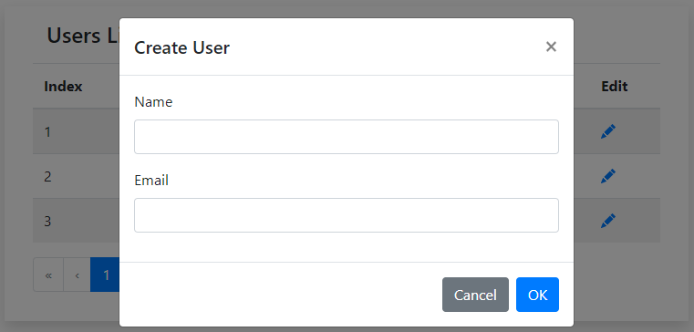
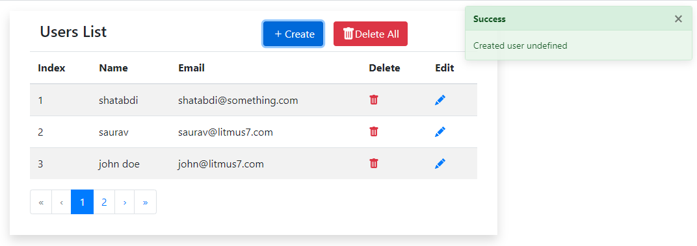
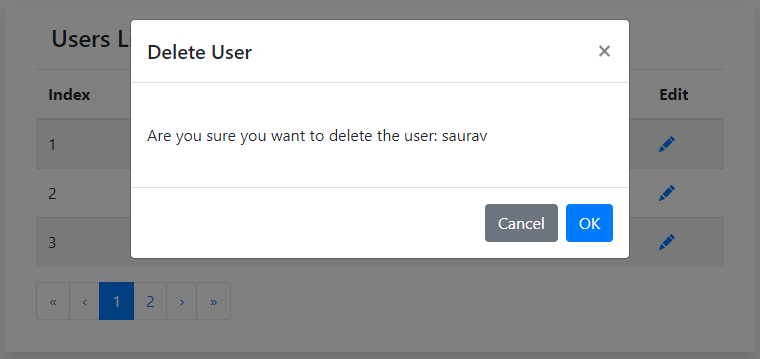

# flask-vuejs-mongodb-crud
Single page application in VueJS that will use flask as backend to demonstrate CRUD operations on a User model.

## Awesome blog ->
Part I - https://saurav-samantray.medium.com/flask-vuejs-mongodb-simple-crud-application-part-i-e7f62ebef532
Part II - Coming Soon!

### Main view

### Create User Modal

### Create User Success

### Delete Confirmation

